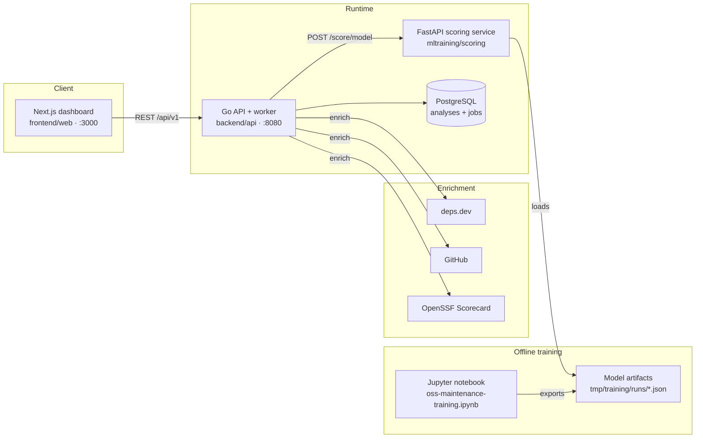

# OSS Risk Radar

**OSS Risk Radar is a decision-support tool for open-source dependency maintenance and supply-chain risk triage.** It helps engineering and security teams see which dependencies look *operationally fragile* — at risk of becoming unmaintained — which public signals shaped that judgement, and where the evidence is incomplete.

It is **not** a vulnerability scanner or a definitive trust score. It estimates *inactivity risk* (the likelihood a project goes effectively unmaintained over the next 12 months) from public repository activity, release rhythm, contributor depth, and backlog dynamics, and always shows the evidence and confidence behind a score.

> The project is the artifact of a bachelor thesis (Design Science Research). The research write-up lives in [`tex/thesis/`](tex/thesis); engineering documentation lives in [`docs/`](docs).

---

## Highlights

- **Analyze a repo or a manifest** — submit a GitHub URL, or upload `package-lock.json`, `requirements.txt`, `poetry.lock`, or `go.mod` to resolve direct and transitive dependencies.
- **Calibrated ML scoring** — staged Logistic Regression and XGBoost artifacts (full-history and cold-start regimes) produce calibrated inactivity-risk probabilities, not opaque scores.
- **Explainable, per-repository** — a logistic coefficient-impact view shows what drove *this* repo's score, with each driver read against the training cohort.
- **Honest confidence** — a transparent per-prediction confidence built from data coverage, in-distribution fit, and calibration support — distinct from the model's global accuracy.
- **Evidence and provenance** — every signal links back to its source (GitHub, Scorecard, deps.dev), and missing signals are surfaced and imputed openly rather than hidden.
- **Durable analysis jobs** — repository enrichment and scoring run as retryable background jobs in PostgreSQL.
- **Reproducible offline training** — a notebook-driven pipeline builds datasets from GH Archive and exports versioned, calibration-first model artifacts.

---

## Architecture



| Component | Path | Stack | Responsibility |
|---|---|---|---|
| Web dashboard | `frontend/web` | Next.js 16, React 19, TypeScript | Submission, analysis overview, dependency graph/path views, ML explanation panel |
| API & orchestration | `backend/api` | Go 1.25 | Analysis lifecycle, durable job worker, manifest parsing, provider enrichment, scoring fan-out/ensemble |
| Scoring service | `mltraining/scoring` | Python 3.14, FastAPI | Model-artifact inference, feature extraction; also hosts the offline training pipeline |
| Shared contracts | `shared/packages/schemas` | TypeScript | Cross-service data contracts |
| Data store | — | PostgreSQL 16 | Analyses, dependencies, jobs |

Runtime scoring is **model-artifact-only**: the API supplies staged artifacts to the scoring service, and a missing required artifact is a deployment error rather than a silent fallback.

---

## Quickstart

### Prerequisites

- Docker + Docker Compose
- Node.js (for the `npm run …` task runner and the frontend)
- A GitHub token is recommended (`GITHUB_TOKEN`) — GitHub enrichment, especially the issue-dynamics signals that use the rate-limited Search API, degrades to "missing" without one.

### One command

```bash
cp .env.example .env        # optional: override defaults
npm run dev
```

This builds and starts PostgreSQL, the Go API, the scoring service, and the frontend through Docker Compose, then waits for the API (`http://localhost:8080/health`) and the frontend (`http://localhost:3000`).

Then open **http://localhost:3000**, submit a GitHub repository URL (or upload a manifest, or run the demo analysis), and watch the analysis resolve.

### Run services individually

```bash
docker compose up -d postgres                                   # database
cd mltraining/scoring && uvicorn app.main:app --reload --port 8090   # scoring (FastAPI)
cd backend/api && go run ./cmd/api                              # API + worker
cd frontend/web && npm run dev                                  # dashboard
```

### How an analysis flows

1. The frontend submits a repository URL or manifest to the Go API.
2. The API registers an analysis and queues a durable background job in PostgreSQL.
3. The worker parses manifests, resolves package metadata via deps.dev, enriches repositories through GitHub, fetches Scorecard signals, and calls the scoring service.
4. The scoring service scores with the staged artifacts and returns inactivity-risk profiles, security-posture context, confidence, caveats, explanation factors, and evidence.
5. The frontend renders the overview, dependency graph/path context, detail views, and the per-repository ML analysis panel.

---

## Configuration

Configuration is environment-driven; see [`.env.example`](.env.example) for the full list. Notable variables:

| Variable | Purpose |
|---|---|
| `DATABASE_URL` / `POSTGRES_*` | Database connection |
| `API_PORT`, `API_ALLOWED_ORIGIN` | API bind port and CORS origin |
| `SCORING_BASE_URL` / `SCORING_SERVICE_URL` | API → scoring service endpoint |
| `NEXT_PUBLIC_API_BASE_URL` / `WEB_API_BASE_URL` | Frontend → API endpoint |
| `GITHUB_TOKEN` | Authenticated GitHub enrichment (recommended) |
| `TRAINING_DATASET_PATH`, `TRAINING_RUNS_DIR` | Locations the API reads training artifacts from |

> Local analysis history in Postgres is disposable for ML retraining. If a schema change leaves the app DB stale, reset only the app database: `docker compose down`, `docker volume rm oss-risk-radar_postgres_data`, `docker compose up -d postgres`. This does not touch `tmp/gharchive`, `tmp/training`, `tmp/notebooks`, or `deployment/training`.

---

## Machine learning pipeline

Model training is **offline and notebook-primary**. [`notebooks/oss-maintenance-training.ipynb`](notebooks/oss-maintenance-training.ipynb) is the visible workflow and the artifact-export boundary; the `ml:*` scripts drive it headlessly.

**Label.** `label_inactive_12m` marks whether a repository becomes effectively unmaintained within a 12-month forward window (the inverse of a 2-of-4 future-activity check). See [`docs/methodology/inactivity-risk.md`](docs/methodology/inactivity-risk.md).

**Models.** A training run produces **six artifacts** — Logistic Regression, XGBoost, and a from-scratch numpy MLP — each in **full-history** and **cold-start** feature regimes. The Logistic Regression and XGBoost artifacts are the **deployed scorers**; the **neural network is trained as an evaluation-only comparison baseline and is deliberately excluded from the deployed ensemble** (the runtime allow-list is `defaultTrainingModelNames` in `backend/api/internal/analysis`).

**Calibration first.** Probabilities are calibrated on a held-out validation slice and evaluated with calibration-sensitive metrics (Brier, ECE) alongside ranking (ROC-AUC). Metric definitions are in the thesis methodology chapter.

Common commands (full list under [Testing & validation](#testing--validation)):

```bash
npm run ml:dataset -- build-all --seed-file <path> --gharchive-source <path> --output-dir tmp/training/oss-maintenance
npm run ml:train          # execute the notebook and export the six-model artifact bundle
npm run ml:stage-training # promote only candidates passing the per-model AUROC/Brier regression gate
```

More detail: [`docs/methodology/historical-dataset-builder.md`](docs/methodology/historical-dataset-builder.md), [`docs/methodology/model-artifact-scoring.md`](docs/methodology/model-artifact-scoring.md), [`docs/methodology/training-operations.md`](docs/methodology/training-operations.md).

---

## Results highlights

Held-out test metrics by model family and feature regime (identical time-aware split, same calibration). Higher is better for ROC-AUC, F1, and quality; lower is better for Brier and ECE. Deployed scorers in **bold**.

| Model | ROC-AUC | Brier | ECE | F1 | Quality |
|---|---|---|---|---|---|
| Logistic Regression — full-history | 0.930 | 0.097 | 0.012 | 0.883 | 0.759 |
| **XGBoost — full-history** | **0.945** | **0.089** | 0.016 | **0.891** | **0.790** |
| Neural network — full-history *(baseline)* | 0.939 | 0.092 | 0.013 | 0.888 | 0.778 |
| Logistic Regression — cold-start | 0.885 | 0.127 | 0.049 | 0.857 | 0.656 |
| **XGBoost — cold-start** | **0.940** | **0.093** | **0.011** | **0.887** | **0.777** |
| Neural network — cold-start *(baseline)* | 0.937 | 0.095 | 0.011 | 0.884 | 0.771 |

The neural-network baseline is competitive but does not improve on gradient-boosted trees on any metric in either regime, which is why XGBoost is deployed and the MLP is reported as a tested-and-rejected alternative. *(Numbers are from the current training run; the inactive base rate of the held-out slice is ~56%.)*

---

## API surface

Public API (`/api/v1`):

```
POST   /api/v1/uploads
POST   /api/v1/analyses
GET    /api/v1/analyses            GET /api/v1/analyses/:id
GET    /api/v1/analyses/:id/dependencies
GET    /api/v1/analyses/:id/graph
GET    /api/v1/dependencies/:id
GET    /api/v1/jobs/:id
GET    /api/v1/training/dataset    GET /api/v1/training/runs    GET /api/v1/training/runs/latest
GET    /health                     GET /ready
```

Internal scoring service: `POST /score/model`, `POST /features/extract`, `GET /health`, `GET /ready`.

Full request/response contracts: [`docs/api/contracts.md`](docs/api/contracts.md).

---

## Testing & validation

```bash
npm run check:web         # lint + build the frontend
npm run test:api          # Go tests
npm run test:scoring      # Python scoring tests
npm run test:ml-scripts   # dataset-downloader and promotion-gate guardrails
```

Training & data tooling:

```bash
npm run ml:seed:foundation -- --target-repositories 5000 --github-token <token>   # build a repo seed from the GitHub Search API
npm run ml:dataset:foundation       # rebuild a foundation candidate from the preserved seed + cached GH Archive
npm run ml:notebook                 # open the JupyterLab workflow
npm run ml:notebook:execute         # smoke-execute the notebook from synthetic inputs
npm run ml:bootstrap -- --seed-file <path> --gharchive-source <path>             # dataset engineering + six-model training
npm run ml:bootstrap:foundation     # rebuild + train from the preserved 5,000-repo inputs
```

---

## Repository layout

```
frontend/web         Next.js dashboard
backend/api          Go API, durable worker, enrichment, scoring orchestration
mltraining/scoring   FastAPI scoring service + offline training pipeline
shared/packages      TypeScript contracts (schemas)
notebooks            oss-maintenance-training.ipynb (visible ML workflow)
deployment           Dockerfiles, Compose/K8s manifests, Argo CD config, Postgres init
docs                 architecture, methodology, threat model, API contracts, roadmap
tex/thesis           thesis (Design Science Research write-up)
scripts              dev startup, ML dataset/training/staging helpers
```

---

## Documentation

- **Architecture** — [`docs/architecture/overview.md`](docs/architecture/overview.md)
- **Methodology** — [`docs/methodology/`](docs/methodology) (inactivity risk, dataset builder, model scoring, training ops)
- **API contracts** — [`docs/api/contracts.md`](docs/api/contracts.md)
- **Threat model** — [`docs/threat-model/initial-threat-model.md`](docs/threat-model/initial-threat-model.md)
- **Roadmap** — [`docs/roadmap/`](docs/roadmap)
- **Deployment** — [`deployment/k8s/README.md`](deployment/k8s/README.md) (k3s + Argo CD)

---

## Positioning

OSS Risk Radar is a decision-support tool for OSS dependency maintenance and supply-chain risk triage. It is intentionally conservative: scores are triage signals backed by visible evidence and confidence, **not** vulnerability findings or definitive trust verdicts.

## License

Not yet licensed — all rights reserved pending a license decision. Please contact the author before reuse.
